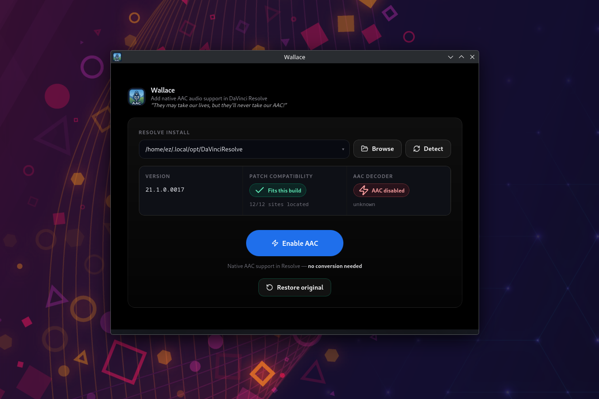

<p align="center">
  
</p>

# Wallace

> *"They may take our lives, but they'll never take our — **A**.**A**.**C**."*
>
> (slightly paraphrased)

<p align="center">
  
</p>

**WALLACE** brings freedom to DaVinci Resolve Studio users on Linux. Not the
grand, historical kind — the kind where you double-click an `.mp4` and the
audio actually plays.

Blackmagic ship Resolve with AAC decode removed for licensing reasons, which
means a great many ordinary `.mp4` and `.mov` files import with silent audio.
Wallace puts it back, natively, without transcoding anything — and wraps it all
in a GUI, so you don't have to think about binary patching on a deadline.

Concretely: Wallace is a **fork of [josephg/resolve-aacfix]** that adds a
desktop GUI and support for the latest DaVinci Resolve 21 releases. All the
reverse engineering, binary patching and tooling is upstream's; this fork adds
the point-and-click layer and keeps pace with Resolve 21.

**Demo** — see it in action:

https://github.com/user-attachments/assets/2772a6a3-ad08-4917-a5e0-9f742fd6d079

What the demo shows: Wallace automatically detects Resolve in the common
installation folders — if it lives somewhere unusual, just browse to the
`resolve` binary yourself. Then hit **Detect**, and **Enable AAC** copies the
necessary files into place so Resolve can play AAC audio natively.

## Getting started (GUI)

Grab the AppImage from [Releases](../../releases), make it executable, and run
it:

```sh
chmod +x Wallace-*.AppImage
./Wallace-*.AppImage
```

(`chmod` is only needed the first time — your file manager's "allow executing
as program" checkbox does the same thing.)

Then, inside the GUI:

1. Close DaVinci Resolve (the patcher can't modify a running binary).
2. **Browse** to the `resolve` binary (Wallace starts in the common
   installation folders), then click **Detect**.
3. Check the detected version, then click **Enable AAC**. That's it.
   **Uninstall** undoes everything, byte-for-byte.

## Or the command line, if that's your thing

The GUI is the primary way to use Wallace, but the same engine ships as a CLI
(`aac-fix`) in the release tarball:

```sh
tar -xzf wallace-*.tar.gz
cd wallace-*
sudo ./aac-fix install          # close Resolve first
./aac-fix status
```

It needs only `python3` and `binutils`; everything else is bundled. To undo it
completely (the English finally catch up):

```sh
sudo ./aac-fix uninstall
```

---

## The usual workaround, and why it gets you killed

The standard advice for AAC-in-Resolve pain is: *"just convert your audio to
PCM"*. And honestly? For one or two files, on a solo project, in your own
timeline, it works fine. Nobody gets hurt.

Now try that in a team environment. Converting audio tracks means **modifying
(or replacing and relinking) source media**. On shared storage. Where other
people's timelines, bins and relinks live. The moment your re-encoded,
renamed, PCM-flavoured copies of the camera originals touch a shared project,
you have stopped being an editor and started being a hazard. One "helpful"
conversion of the master media folder and *you* are the reason the offline
edit sounds different from the online edit. That is the sort of thing you do
not recover from professionally.

And even if nobody shoots you: it doesn't *scale*. Converting works for a few
files. What about hundreds? Thousands? Terabytes of camera originals,
re-encoded one at a time into duplicate PCM copies that eat storage, drift out
of sync with the originals, and have to be tracked and relinked forever?

Wallace's whole point is that you never have to: the source media stays
exactly as the camera delivered it, and Resolve simply learns to read it.

## How it works (the short version)

Resolve on Linux is shipped *able* to ask for AAC audio, but with the piece
that decodes it deliberately taken out. Wallace teaches it to ask again, and
puts a decoder back where one used to be. That's it.

- It only ever **adds** — nothing already working (MP3, FLAC, PCM, anything
  else) is touched.
- **Uninstall puts everything back exactly as it was**, byte for byte.
- If Wallace doesn't recognise your Resolve build, it **refuses and changes
  nothing** rather than guessing.

The gory details — trampolines, signatures, FFmpeg builds — live in
[`docs/`](docs/), written up at length, dead ends included.

## Compatibility

**Wallace is built for DaVinci Resolve Studio 21 on Linux (x86-64).** That's
what it's tested on, and what it's for. Anything else — different versions,
the free edition, other platforms — is uncharted water: **use at your own
risk.**

- **Works:** `.mp4`, `.mov`, `.m4a`, and `.mkv` files **with a video track**,
  LC-AAC and HE-AAC.
- **Doesn't (yet):** raw `.aac`, `.ts`, `.flv`, MXF. See
  [`docs/further-work.md`](docs/further-work.md).
- Audio-only `.mkv` files are silent in Resolve for *every* codec — that's a
  Resolve quirk, not Wallace. Put a video track in the file.
- Close Resolve before installing or uninstalling.
- If something misbehaves, please [file an issue](../../issues) with your
  Resolve version and the GUI's status output.

## Documentation

| | |
|---|---|
| [`docs/reverse-engineering.md`](docs/reverse-engineering.md) | how AAC was removed and how each removal was found and undone |
| [`docs/further-work.md`](docs/further-work.md) | how to continue: methods that worked, mistakes that cost days, starting points for `.aac`/`.ts` |
| [`docs/tooling.md`](docs/tooling.md) | the tracer, the coverage differ, the gdb scripts and the `.text` scanners |
| [`docs/ffmpeg-libs.md`](docs/ffmpeg-libs.md) | Blackmagic's recovered configure line, soname matching, the AV3A backport |
| [`docs/packaging.md`](docs/packaging.md) | the installer's safety properties, `build-deb`, release layout |
| [`docs/notes/`](docs/notes/) | the original unedited session notes, dead ends included |

## Credits

- [josephg/resolve-aacfix] — the reverse engineering, the binary patches, the
  tooling, and most of the docs this fork is built on. Wallace stands on it.
- [e9patch] by Gregory J. Duck et al. — the trampoline rewriter that makes
  patching a 653 MB stripped binary possible at all.
- [makeresolvedeb] by Daniel Tufvesson.
- [FFmpeg](https://ffmpeg.org).
- [davinci-resolve-linux-aac-fix](https://davinci-resolve-linux-aac-fix.netlify.app/)
  — an alternative worth knowing about: it works by caching PCM conversions of
  files as you play them, where Wallace decodes AAC natively instead.

Licenses and exact pinned sources: [`THIRD-PARTY.md`](THIRD-PARTY.md).
This project's own code is MIT ([`LICENSE`](LICENSE)).

Nothing here contains any part of DaVinci Resolve. It patches a copy you
already have.

## ⚠️ Use at your own risk

This patches Resolve's installed binaries in place. It keeps a verified backup
and uninstall restores the original byte-for-byte, but a bad patch can still
break your Resolve installation — **do not use Wallace in production until
you've tested it on your own setup.**

[josephg/resolve-aacfix]: https://github.com/josephg/resolve-aacfix
[e9patch]: https://github.com/GJDuck/e9patch
[makeresolvedeb]: https://www.danieltufvesson.com/makeresolvedeb